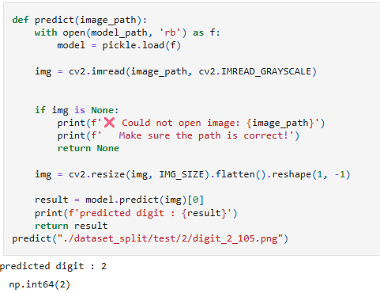

# Assignment 1: Digit Detection without Neural Networks

<p>
  
  
  
</p>

## Project Snapshot

This project classifies handwritten digit images from `0` to `9` using the **K-Nearest Neighbors (KNN)** algorithm. It does not use neural networks.

| Item | Details |
| --- | --- |
| Model | KNN |
| Distance metric | Euclidean |
| K value | 5 |
| Dataset location | `../Datasets/Assignment-1/` |
| Main file | `Assignment_1.ipynb` |
| Saved model | `knn_model.pkl` |

## Prerequisites

Install Python 3.10+ and Jupyter, then install the required packages:

```bash
pip install notebook numpy opencv-python scikit-learn split-folders kagglehub matplotlib
```

## Dataset Setup

The dataset is stored outside this assignment folder to keep the project arranged:

```text
../Datasets/Assignment-1/
├── dataset/
│   ├── 0/
│   ├── 1/
│   └── ...
└── dataset_split/
    ├── train/
    ├── val/
    └── test/
```

The notebook is already updated to use these paths. If you download the dataset again, save it to:

```text
../Datasets/Assignment-1/dataset
```

## How to Run

From this folder:

```bash
jupyter notebook Assignment_1.ipynb
```

Run the notebook cells in order:

1. Download or load the digit dataset.
2. Split the dataset into train, validation, and test folders.
3. Convert images into feature arrays.
4. Train the KNN model.
5. Save the trained model as `knn_model.pkl`.
6. Run prediction on a test image.

## How to Use

Use this prediction format inside the notebook:

```python
predict("../Datasets/Assignment-1/dataset_split/test/2/digit_2_105.png")
```

Replace the path with any image from the test split.

## Output Preview



## Notes

<span style="color:#27AE60"><b>Good for:</b></span> learning image classification fundamentals without neural networks.

<span style="color:#C0392B"><b>Limitation:</b></span> KNN can become slow when the image dataset grows large because it compares against stored samples.
