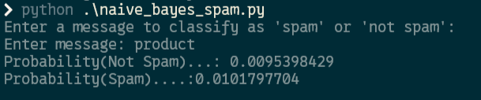

# Assignment 2: Spam Detection with Naive Bayes

<p>
  
  
  
</p>

## Project Snapshot

This project classifies a text message as **SPAM** or **NOT SPAM** using Naive Bayes probability logic written from scratch.

| Item | Details |
| --- | --- |
| Main file | `naive_bayes_spam.py` |
| Dataset location | `../Datasets/Assignment-2/dataset.csv` |
| Input | User-entered message |
| Output | Spam probability, not-spam probability, final class |

## Prerequisites

Python 3.10+ is enough. This assignment uses only built-in Python modules.

```bash
python --version
```

## Dataset Setup

The CSV file is now stored in the shared dataset folder:

```text
../Datasets/Assignment-2/dataset.csv
```

Expected format:

| word | not_spam | spam |
| --- | ---: | ---: |
| hello | 10 | 2 |
| offer | 1 | 15 |

## How to Run

From the repository root:

```bash
python Assignment-2/naive_bayes_spam.py
```

Or from inside `Assignment-2`:

```bash
python naive_bayes_spam.py
```

## How to Use

When prompted, type a message:

```text
Enter message: congratulations you won an offer
```

The script prints:

```text
Probability(Not Spam)
Probability(Spam)
The message is classified as: SPAM or NOT SPAM
```

## Output Preview



## Notes

<span style="color:#27AE60"><b>Good for:</b></span> understanding Bayes theorem, word frequencies, and Laplace smoothing.

<span style="color:#C0392B"><b>Limitation:</b></span> accuracy depends heavily on the quality and size of `dataset.csv`.
