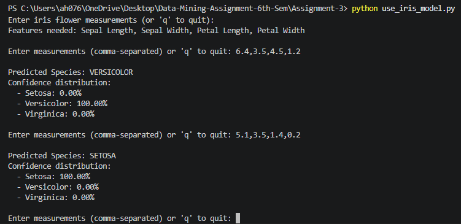

# Assignment 3: Iris Classification with KNN

<p>
  
  
  
</p>

## Project Snapshot

This project trains a KNN model to classify Iris flowers into **Setosa**, **Versicolor**, or **Virginica**.

| Item | Details |
| --- | --- |
| Training file | `iris_model_training.py` |
| Usage file | `use_iris_model.py` |
| Batch CSV | `../Datasets/Assignment-3/iris_data/iris.csv` |
| Model output | `iris_knn_model.pkl` |
| Scaler output | `iris_scaler.pkl` |
| Prediction output | `iris_predictions.csv` |

## Prerequisites

Install Python 3.10+ and the required packages:

```bash
pip install numpy pandas scikit-learn matplotlib seaborn
```

## Dataset Setup

Training uses the built-in Iris dataset from `sklearn.datasets`. Batch prediction uses the CSV stored here:

```text
../Datasets/Assignment-3/iris_data/iris.csv
```

Expected feature columns:

| Feature |
| --- |
| `SepalLengthCm` |
| `SepalWidthCm` |
| `PetalLengthCm` |
| `PetalWidthCm` |
| `Species` |

## How to Train

From the repository root:

```bash
python Assignment-3/iris_model_training.py
```

This creates or updates:

```text
Assignment-3/iris_knn_model.pkl
Assignment-3/iris_scaler.pkl
Assignment-3/iris_model_performance.png
```

## How to Use

After training, run:

```bash
python Assignment-3/use_iris_model.py
```

The script demonstrates three usage modes:

1. Predict predefined sample flowers.
2. Predict a batch from `iris.csv`.
3. Enter your own measurements interactively.

Manual input format:

```text
5.0, 3.5, 1.3, 0.3
```

## Output Preview



## Notes

<span style="color:#27AE60"><b>Good for:</b></span> learning train-validation-test splits, feature scaling, and classification metrics.

<span style="color:#C0392B"><b>Limitation:</b></span> KNN is simple and effective here, but it may slow down on much larger datasets.
