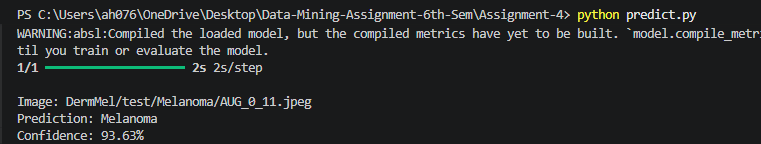
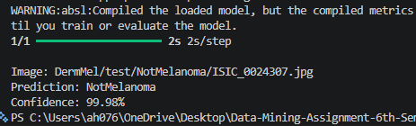
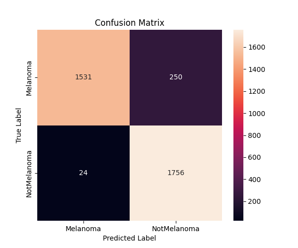

# Assignment 4: Skin Cancer Detection with MobileNetV2

<p>
  
  
  
</p>

## Project Snapshot

This project classifies skin images as **Melanoma** or **NotMelanoma** using transfer learning with MobileNetV2.

| Item | Details |
| --- | --- |
| Training file | `train_model.py` |
| Prediction file | `predict.py` |
| Dataset location | `../Datasets/Assignment-4/DermMel/` |
| Final model | `cancer_model.h5` |
| Best checkpoint | `best_model.h5` |
| Class names | `class_names.txt` |
| Confusion matrix | `confusion_matrix.png` |

## Prerequisites

Install Python 3.10+ and the required packages:

```bash
pip install tensorflow numpy pillow matplotlib seaborn scikit-learn
```

TensorFlow can be heavy. If installation fails, use a Python version supported by your TensorFlow release.

## Dataset Setup

The dataset is stored in the shared dataset folder:

```text
../Datasets/Assignment-4/DermMel/
├── train_sep/
│   ├── Melanoma/
│   └── NotMelanoma/
├── valid/
│   ├── Melanoma/
│   └── NotMelanoma/
└── test/
    ├── Melanoma/
    └── NotMelanoma/
```

The scripts are already updated to read from this location.

## How to Train

From the repository root:

```bash
python Assignment-4/train_model.py
```

The training workflow:

1. Loads images with `ImageDataGenerator`.
2. Applies preprocessing and augmentation.
3. Trains MobileNetV2 transfer-learning layers.
4. Fine-tunes the last 30 base-model layers.
5. Saves the trained models and confusion matrix.

## How to Predict

Make sure `cancer_model.h5` exists, then run:

```bash
python Assignment-4/predict.py
```

To test a different image, edit the path at the bottom of `predict.py`:

```python
image_path = "Datasets/Assignment-4/DermMel/test/NotMelanoma/ISIC_0024307.jpg"
```

## Output Preview







## Notes

<span style="color:#27AE60"><b>Good for:</b></span> transfer learning, image augmentation, and model evaluation.

<span style="color:#C0392B"><b>Limitation:</b></span> medical image classifiers require careful validation and should not be used as a real diagnosis tool.
